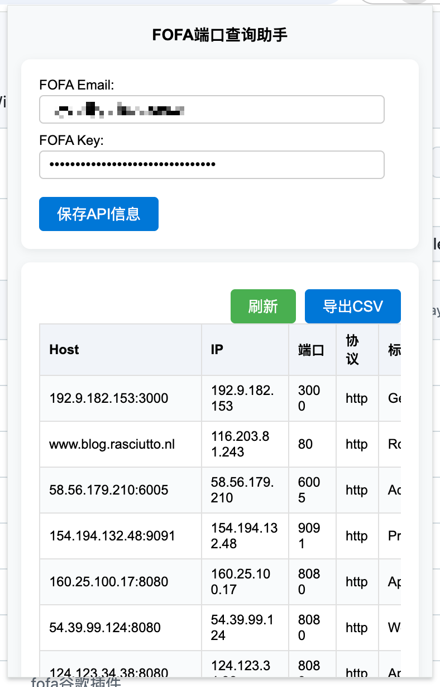

# FOFA端口查询助手（Chrome插件）

> 作者：[maikefee](https://github.com/Maikefee)



## 简介

FOFA端口查询助手是一款基于FOFA API的Chrome浏览器插件，支持一键查询当前页面主机的开放端口、协议、IP、操作系统等信息，并可统计聚合全球资产分布。适合安全研究、资产测绘、渗透测试等场景。

## 功能特性
- 自动获取当前标签页URL并查询主机信息
- 展示主机的端口、协议、IP、标题、操作系统等
- 支持FOFA统计聚合（协议、端口、国家、操作系统、Server等前5）
- 支持一键导出查询结果为CSV文件
- 支持刷新按钮实时重新请求数据
- 美观简洁的UI，支持表格横向滚动
- 支持FOFA账号信息本地保存

## 安装方法
1. 克隆或下载本项目到本地：
   ```bash
   git clone https://github.com/Maikefee/fofa-chrome-extension.git
   ```
2. 打开 Chrome 浏览器，进入 `扩展程序` 页面（chrome://extensions/）。
3. 开启右上角“开发者模式”。
4. 点击“加载已解压的扩展程序”，选择 `fofa-chrome-extension` 目录。
5. 安装完成后，浏览器右上角会出现插件图标。

## 使用说明
1. 点击插件图标，首次需输入 FOFA 账号邮箱和 API Key，点击“保存API信息”。
2. 打开任意网站页面，点击插件图标即可自动查询该主机的端口等信息。
3. 可点击“刷新”按钮重新请求数据。
4. 可点击“导出CSV”按钮将当前查询结果导出为CSV文件。
5. 下方统计区展示协议、端口、国家、操作系统、Server等前5聚合信息。

## FOFA API配置
- 需注册FOFA账号并获取API Key：[FOFA官网](https://fofa.info/)
- 仅支持有API权限的账号（普通用户每日有免费额度）

## 常见问题
- **为什么统计聚合只能显示前5？**
  - 这是FOFA官方API的限制，接口只返回每个字段的前5排名。
- **为什么有时查不到数据？**
  - 目标主机未被FOFA收录或API Key额度不足。
- **如何查看更多字段？**
  - 可在代码中调整fields参数，FOFA支持的字段详见[官方文档](https://fofa.info/api)。

## 开源协议
MIT

## 作者信息
- 作者：maikefee
- GitHub: [https://github.com/Maikefee](https://github.com/Maikefee)

欢迎Star、Fork和反馈建议！ 